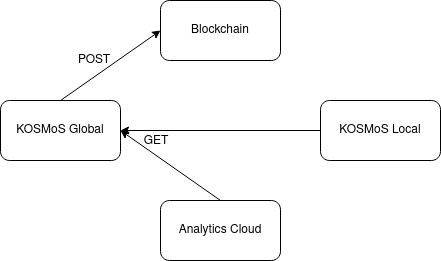
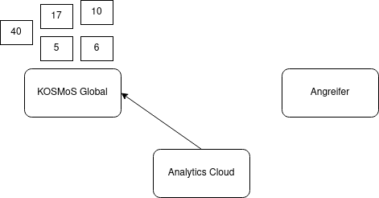
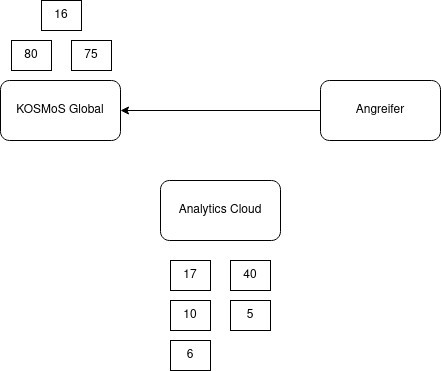
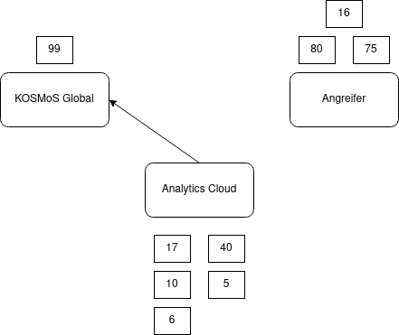

# Definitionen
## Resilience
:::notes
:::
### Allgemein Definition
Die Fähigkeit eines komplexen Systems trotz massiver externer oder interner Störungen wieder in den
Ausgangszustand zurückzukehren.  (wikipedia)

### Technische Systeme Definition
Technische Systeme werden als resilient bezeichnet, wenn sie auch beim Auftreten von inneren und
äußeren Ausfällen und Störungen die angeforderten Systemleistungen aufrechterhalten. (wikipedia)

## Datenkonsistenz
### Definition
Die Korrektheit der gespeicherten Daten und alle Replica eines Datums sind identisch. (wikipedia)

### Bezug KOSMoS
Vertragsdaten müssen von KOSMoS Global auf die einzelnen beteiligten Systeme synchronisiert werden.
Die einzelnen Verträge müssen aber zwischen den einzelnen System in den synchronisierten Daten
gleich sein. => Daten müssen konsistent sein.

## Informationssicherheit
### Definition
Als Informationssicherheit bezeichnet man Systeme, die die Schutzziele Vertraulichkeit, Verfügbarkeit und Integrität sicherstellen. Es dient zum Schutz vor Gefahren bzw. Bedrohungen und der Vermeidung
wirtschaftlicher Schäden und der Minimierung von Risiken. (wikipedia)

## Funktionsweise GET-Request
### GET Request via Telnet
```bash
telnet inovex.de 80
```
Telnet Eingabe abschließen mit mehreren Newlines:
```http
GET / HTTP/1.1
Host: inovex.de
```
### Absicherung über TLS
Nur zusätzliche Schicht zur Verschlüsselung ansonsten Plain HTTP => obige eingabe kann anstannt mit
telnet mit gnutls-cli durchgeführt werden.

# Möglichkeiten
## RESTFUL
- Verwendung von einzigartigen IDs pro Vertrag
- Query aktiver Verträge
- Generierung der Response aus DB
- Abfrage gezielter Verträge, wenn Daten nicht vorhanden
- (Update Vertrag nicht benötigt durch System Architektur)
- Alle x Min Abfrage der Daten
- Benötigt kein extra Serversystem
- Durch Generierung der Response aus DB sind Daten immer aktuell

## HTTP Since last Request (Server based)
- Server merkt sich zu einem Client, wann die Daten zuletzt abgeholt wurden
- Response beinhaltet nur Änderungen an den Verträgen
- Status im Server
- Benötigt kein extra Serversystem 
- Alle x Min Abfrage der Daten
- Durch Generierung der Response aus DB sind Daten immer aktuell

## HTTP Since last Request (Client based)
- Server stateless
- API nimmt Zeitstempel entgegen
- Response beinhaltet alle Vertragsänderungen seit dem übermittelten Zeitstempel
- Keine extra Serversystem
- Alle x Min Abfrage der Daten
- Durch Generierung der Response aus DB Daten immer aktuell

## HTTP Post / Put
- Vertragsdaten werden zu x aktive gesendet
- Nur bei Änderungen werden Nachrichten gesendet
- Fein granular
- Eingehende Kommunikation muss möglich sein
- Analyse Platform / KOSMoS Lokal müssen Webserver umsetzen

## Kafka
- Verwendung eines Publish / Subscribe Models => extra Server System mit Kafka Broker
- Änderungen werden übermittelt
- Speicherung der Nachrichten über einen konfigurierten Zeitraum (DEFAULT 1 Woche)

## MQTT
- Verwendung eines Publish / Subscribe Models => extra Server System mit MQTT Brocker
- Die niedrigere QoS wird verwendet
  0. At most once (keine Garantien oder Fire and Forget)
  1. At least once (Garantiert, dass wenigstens ein ein Empfänger die Nachricht empfangen hat)
  2. Exactly once (genau einem Subscriber über 4 Wege Handshake)
- In QoS 1 und 2 werden Nachrichten für Offline Clients gespeichert (Message Queue), wenn diese
über eine Persistente Session angebunden sind.

([https://www.hivemq.com/blog/mqtt-essentials-part-6-mqtt-quality-of-service-levels/](https://www.hivemq.com/blog/mqtt-essentials-part-6-mqtt-quality-of-service-levels/))


## HTTP Websocket
- Innerhalb des HTTP-Servers
- Bidirektionale Verbindung
- Vom Client initialisiert
- Konsistenz wird sofort durchgeführt
- Abruf der Daten aus DB über Anfrage nach Implementation möglich
- Keine separate Datenspeicherung
- Asynchrones Protokoll
- Fein granular nach Verbindung + Abruf der Daten

# Problematik
## RESTFUL
- Angreifer kann Informationen über alle aktiven Verträge abrufen (Datenleck)
- Geringe Serverauslastung, da Response wiederverwendbar
- Daten erst nach Synchronisation konsistent

## HTTP Since last Request (Server based)
- Änderungen seit letztem Login abrufen
- Verhinderung der Updates an den Client, da Änderungen schon versendet
- Geringe Serverauslastung
- Daten müssen nicht konsistent sein
- Datenleck weiterhin vorhanden aber gering

## HTTP Since last Request (Client based)
- Datenleck maximal, da alle Änderungen abgerufen werden können (Timestamp = 0)
- Hohe Serverauslastung zum Abfragezeitpunkt, da pro Anfrage Response generiert wird
- Daten erst nach Synchronisation konsistent

## HTTP Post / Put
- Datenleck nur beim aufbrechen der Verschlüsselung
- Aufwendige Implementierung zur Sicherstellung von Resilience und Konsistenz
- Eingehende Kommunikation muss möglich sein (Firewall Regeln)
- Clients müssen über spezifizierten Port (NAT) oder Globaler IP-Adresse erreichbar sein

## Kafka
- Komplexes weiteres System
- Daten sofort konsistent
- Bei Ausfall des Publishers keine Benachrichtigung des Clients
- Einrichtung einer bidirektionale Kommunikation möglich (dadurch vollständiger Wissensaustausch möglich)
- Angreifer erhält alle Informationen, die in Kafka gespeichert sind
- Daten Konsistenz nur vorhanden wenn zusätzlich ALLE Nachrichten gespeichert werden
  - (Vertragsdauer > Speicherung der Nachrichten)
  - Doppelte Datenspeicherung (sowohl in DB als auch in Kafka)
  - trotzdem möglich alle Verträge abzurufen

## MQTT
- Weniger Komplex als Kafka aber immer noch Komplex und weiteres System
- Neue Subscriber erfahren nichts über vergangene Nachrichten (Verträge)
- Einrichtung einer bidirektionale Kommunikation möglich (dadurch vollständiger Wissensaustausch möglich)
- Möglichkeiten der persistenten Session und der Speicherung der Nachrichten.

## HTTP Websocket
- Erhöht Komplexität gering
- Größere Implementationsaufwand
- Datenleck möglich nach herausfinden von Nutzer/Passwort (Änderungen seit X)
- Datenleck möglich nach herausfinden von Nutzer/Passwort + Kommando vollständig
- Ohne Kommando zum abrufen anfällig für Verbindungsabbrüche 

# Beispiel

## Ausgangssituation (letztes Treffen / Demonstrator)
- HTTP POST/PUT zur Blockchain
- HTTP GET Abfrage von KOSMoS Local / Analytics Cloud

{width=60%}

## Unterdrückung von Updates
- HTTP GET Server verwaltet Diff anhand von Login
- Analytics Cloud Client ruft Daten ab

{width=60%}

## Unterdrücken von Updates
- Analyse Cloud hat Daten übertragen / Neuer Diff wird erstellt
- Angerifer baut Verbindung mit KOSMoS Global auf (Zugangsdaten von Analytics Cloud Client)

{width=60%}

## Unterdrückung von Updates
- Angreifer hat Verträge 16, 80 und 75 / Neuer diff wird erstellt
- Analytics Cloud Client fragt Daten ab / Verträge 16, 80 und 75 nicht im Diff enthalten

{width=60%}
